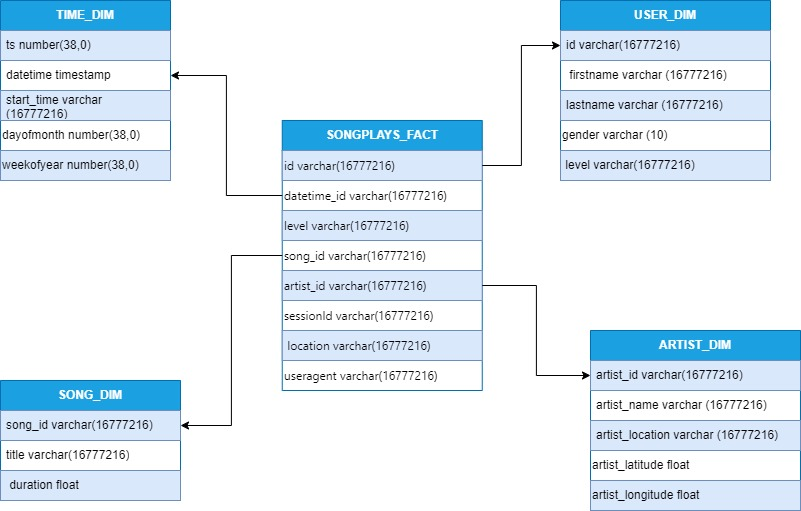

# Mini Music Project ETL
## Overview
**Objective:** The Primary objective of this project is to develop a robust ETL pipeline for Sparkify, A music Streaming startup to facilitate the analysis of user activity and song play data. The project aims to migrate existing data warehouse to a data lake setup, leveraging Snowflake for enhances scalability and performance.

---

## Design Diagram
**Diagram Description**: The design below outlines the entire ETL process and data architecture for Sparkify.


---

## DDL Scripts
```sql
create or replace TRANSIENT TABLE TECHCATALYST_DE.AZODGE.SONGS_DIM (
    song_id varchar(16777216),
    title    varchar(16777216),
    duration float
);

create or replace TRANSIENT TABLE TECHCATALYST_DE.AZODGE.USER_DIM (
    id varchar(16777216),
    firstname varchar (16777216),
    lastname varchar (16777216),
    gender varchar (10),
    level varchar(16777216)
    
);

create or replace TRANSIENT TABLE TECHCATALYST_DE.AZODGE.TIME_DIM (
    ts number(38,0),
    datetime timestamp,
    start_time varchar (16777216),
    dayofmonth number(38,0),
    weekofyear number(38,0)
);

create  or replace TRANSIENT TABLE TECHCATALYST_DE.AZODGE.ARTIST_DIM (
    artist_id varchar(16777216),
    artist_name varchar (16777216),
    artist_location varchar (16777216),
    artist_latitude float,
    artist_longitude float
);

create or replace TRANSIENT TABLE TECHCATALYST_DE.AZODGE.SONGPLAYS_FACT (
    id varchar(16777216),
    datetime_id varchar(16777216),
    level varchar(16777216),
    song_id varchar(16777216),
    artist_id varchar(16777216),
    sessionId varchar(16777216),
    location varchar(16777216),
    useragent varchar(16777216)
);
```


## ETL Pipeline


The ETL process for Sparkify extracts user activity and song data from JSON files in S3, transforms the data by lceaning and normalizt it, and then relopading it into S3 with structured naming and categorization. Finally, teh data is staged and loaded into Snowflkae tables for detailed analysis and reporting.

---


## Summary
This ETL approach not only ensures high data quality and consistency across different data sources but also enhances Sparkify's analytical capabilities, enabling more sophisticated analysis and reporting. By leveraging cloud-based technologies and strategic data structuring, this pipeline has improved scalability and performance of Sparkify's data management systems.

---

## Discussion: Data Lake and Data Warehouse
A data lake like S3 is useful for a startup like Sparkify because it allows for the economical storage of vast amounts of diverse data like unstructured and structured data. In contrast, a datawarehouse like Snowflake enables Sparkify to efficiently analyze and store structured data. These tools together provide a comprehensive data management solution.

---